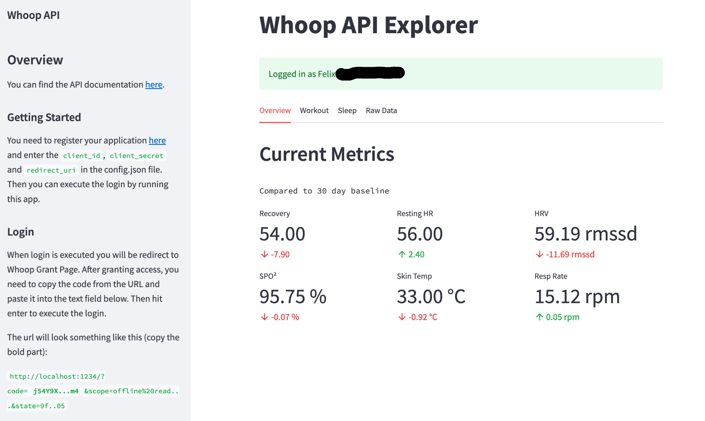
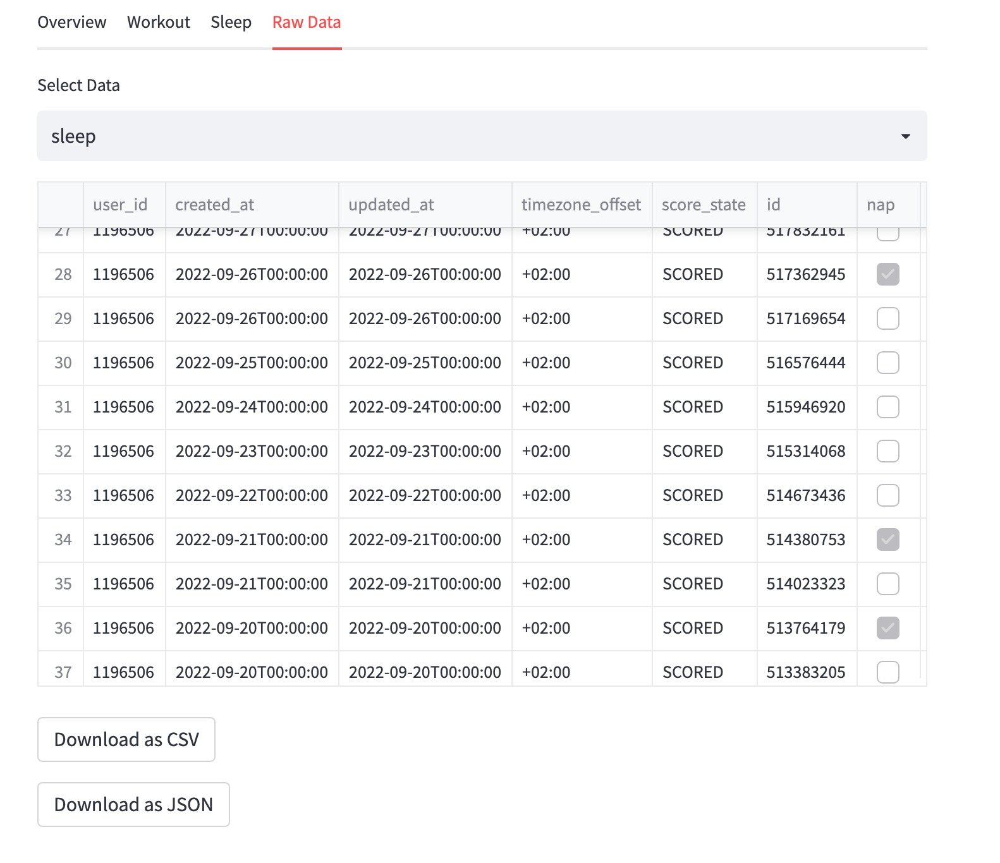

# Whoop Python Client

This is an unofficial implementation of the [official Whoop API](https://developer.whoop.com/docs/introduction).

## Getting Started

First you will need to install the library:

```bash
# either from pypi
pip install whoopy
# or by local build
pip install .
```

In order to use the API, you will need to register your application [here](https://developer-dashboard.whoop.com/) and
enter the `client_id`, `client_secret` and `redirect_uri` in the `config.json` file (you can use the template provided in `config.sample.json`):

```json
{
    "client_id": "YOUR_CLIENT_ID",
    "client_secret": "YOUR_CLIENT_SECRET",
    "redirect_uri": "YOUR_REDIRECT_URI"
}
```

> Note: For the purposes of local use, you can simply provide `http://localhost:1234` as redirect_uri in the app registration

### Authorization

You can then the config to run through the client authentication and save the token:

```python
import json
from whoopy import WhoopClient

# load the config
conf = json.load(open("config.json", "r"))

# either run through full auth process (useful in jupyter notebooks)
# note: This will open the web browser and require you to copy the code parameter from the resulting uri back
client = WhoopClient.auth_flow(conf["client_id"], conf["client_secret"], conf["redirect_uri"])

# or run through the steps manually (useful in backend)
url = WhoopClient.auth_url(conf["client_id"], conf["client_secret"], conf["redirect_uri"])
# (open here or run a redirect on your backend)
webbrowser.open(url)
# retrieve code
code = input("Auth Code")
client = WhoopClient.authorize(code, conf["client_id"], conf["client_secret"], conf["redirect_uri"])
```

The code can be copied from the address in the browser (marked in bold):

`http://localhost:1234/?code=`**`j54Y9X...m4`**`&scope=offline%20read...&state=9f..05`

> **Note** If you want to know more about this, see [OAuth Flows](https://auth0.com/docs/get-started/authentication-and-authorization-flow/authorization-code-flow)

You can also provide a `scope` argument to limit what your client can read.

The system also allows to store, load and refresh your token (given that the `offline` scope is set):

```python
# store the token
client.store_token(".tokens/token.json")

# load the token
client_new = WhoopClient.from_token(".tokens/token.json", config["client_id"], config["client_secret"])

# refresh the current token
client.refresh()
```

### Data Retrieval

Once you have the client registered you can retrieve the data through the different sub-functions:

```python
# user info
user_data = client.user.profile()
print(f"Name: {user_data.first_name} {user_data.last_name}")

# other data includes recovery, workout, cycle, sleep (all share the same interface)
# retrieve by single id
item = client.cycle.single("1234")
# this retrieves a list of items
items, _ = client.cycle.collection(start="2022-05-10", end="2022-07-03")
# note: whoop paginates these items - if you want to control the page yourself you can use the token
items1, token = client.cycle.collection(start="2022-05-10", end="2022-07-03", get_all_pages=False)
items2, token = client.cycle.collection(start="2022-05-10", end="2022-07-03", next=token, get_all_pages=False)
# retrieve data as pandas dataframe
df, _ = client.cycle.collection_df(start="2022-05-10", end="2022-07-03")
```

For a full description of the available routes, see [official docs](https://developer.whoop.com/api).

## Tools

The repo also contains a dashboard to explore and download your whoop data using streamlit.

To get started, simply install the requirements in the `tools/explorer` folder:

```bash
pip install -r requirements.txt
```

Then run the streamlit app:

```bash
streamlit run explorer.py
```

This should give you the dashboard:


It also allows you to download your data directly:

